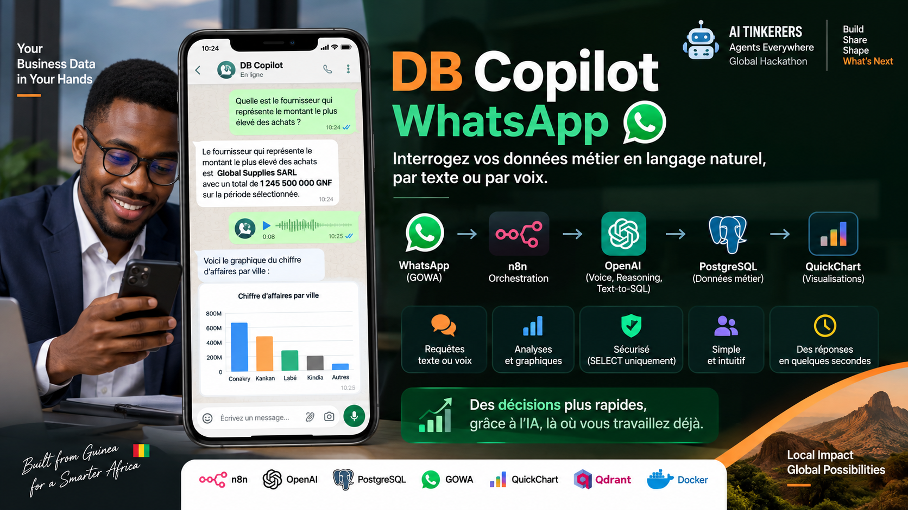
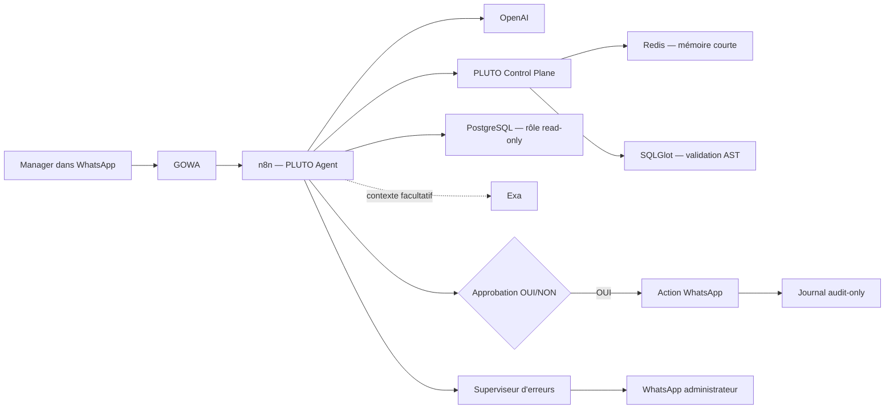

# PLUTO DB Copilot



> **Un agent métier qui vit dans WhatsApp, surveille l'entreprise, enquête
> sur les anomalies et agit uniquement après approbation humaine.**

PLUTO DB Copilot transforme WhatsApp en interface opérationnelle pour une base
ERP PostgreSQL. Un manager peut poser une question en français, poursuivre la
conversation, demander un graphique, recevoir une alerte proactive et autoriser
une action réelle avec un simple **OUI**.

Le projet est porté depuis la **Guinée** pour la compétition mondiale
**AI Tinkerers — Agents Everywhere**.

[Installation Docker](#installation-docker) ·
[Démo jury](examples/QUESTIONS_LIVE_JURY.md) ·
[Architecture et sécurité](docs/PLUTO_V7_COMPETITION.md) ·
[Tests](examples/PLUTO_V7_TESTS.md)

## Pourquoi ce n'est pas un simple chatbot

Un chatbot attend une question et génère du texte. PLUTO possède une boucle
opérationnelle complète :

1. il reçoit texte ou note vocale dans WhatsApp ;
2. il comprend la demande et conserve le contexte utile ;
3. il génère puis valide une requête SQL en lecture seule ;
4. il analyse les données réelles et produit une réponse ou un graphique ;
5. en arrière-plan, il surveille ventes et stocks ;
6. s'il détecte un signal fiable, il enquête et propose une action ;
7. il attend l'approbation du manager ;
8. il exécute l'action, confirme le résultat réel et écrit une preuve d'audit.

Le principe central est simple :

> **Le LLM propose. L'humain autorise. Une règle déterministe exécute. Le
> journal d'audit prouve.**

## Démonstration en 60 secondes

```text
Manager : Quel est le chiffre d'affaires payé ce mois-ci ?
PLUTO   : Réponse calculée depuis PostgreSQL.

Manager : Et pour le mois dernier ?
PLUTO   : Comprend le suivi grâce à sa mémoire Redis.

Manager : Fais-en un graphique.
PLUTO   : Envoie la visualisation dans WhatsApp.

Manager : /demo-alerte
PLUTO   : Explique l'anomalie, sa cause, sa confiance et propose une action.

Manager : OUI
PLUTO   : Envoie réellement l'action, confirme et la journalise.

Manager : /audit
PLUTO   : Affiche la preuve de l'action.
```

Le script complet pour enregistrer la vidéo est dans
[`examples/QUESTIONS_LIVE_JURY.md`](examples/QUESTIONS_LIVE_JURY.md).

## Capacités principales

| Capacité | Comportement |
|---|---|
| Texte et voix | Questions françaises par message ou note vocale WhatsApp |
| Text-to-SQL | Traduction vers PostgreSQL à partir du schéma ERP autorisé |
| Mémoire | Suivis comme « et le mois dernier ? » via Redis avec expiration |
| Visualisation | Graphiques générés à partir des résultats réels |
| Autocorrection | Une tentative SQL maximum, puis retour dans toutes les validations |
| Surveillance | Détection planifiée des baisses de ventes et risques de rupture |
| Enquête | Croisement de plusieurs requêtes et contexte Exa facultatif |
| Contrôle humain | OUI/NON lié au même chat et valable 30 minutes |
| Action | Envoi WhatsApp uniquement après approbation explicite |
| Audit | Référence, horodatage, approbateur haché et credential séparée |
| Résilience | Accusé immédiat, fallbacks clairs et superviseur d'erreurs privé |

## Architecture



### Défense SQL en profondeur

Chaque requête traverse quatre barrières :

1. prompt limité au schéma métier ;
2. garde déterministe contre écritures et instructions multiples ;
3. véritable AST SQLGlot avec allowlist des tables, fonctions et relations
   `JOIN` ;
4. `EXPLAIN` PostgreSQL avec un rôle strictement read-only avant le `SELECT`.

La correction automatique ne contourne aucune barrière et ne peut s'exécuter
qu'une seule fois par message.

## Stack

- **n8n** : orchestration de l'agent ;
- **OpenAI** : compréhension, Text-to-SQL, correction et synthèse ;
- **Exa** : contexte externe facultatif ;
- **PostgreSQL 16** : données ERP, préflight et audit ;
- **SQLGlot + FastAPI** : contrôle AST interne ;
- **Redis 7** : mémoire conversationnelle temporaire ;
- **GOWA** : passerelle WhatsApp ;
- **QuickChart** : visualisations ;
- **Docker Compose** : installation reproductible.

## Installation Docker

### Prérequis

- Docker Desktop ou Docker Engine avec Compose v2 ;
- Git ;
- un compte OpenAI avec une clé API ;
- un compte Exa facultatif ;
- un numéro WhatsApp de test, jamais un numéro client réel pour la démo.

Les ports locaux utilisés sont `5678` pour n8n et `3001` pour GOWA. Qdrant
reste facultatif via le profil `rag`. Le service de contrôle et Redis ne sont
pas exposés publiquement.

### 1. Cloner et configurer

```bash
git clone https://github.com/Salif50/DBCopilotWhatsAppERP.git
cd DBCopilotWhatsAppERP
cp .env.example .env
```

Modifier `.env` et remplacer toutes les valeurs `CHANGE_ME`. Les plus
importantes sont :

```dotenv
POSTGRES_PASSWORD=un-secret-fort
N8N_ENCRYPTION_KEY=une-cle-longue-et-aleatoire
GOWA_BASIC_AUTH=admin:un-secret-fort
PLUTO_CONTROL_TOKEN=un-autre-secret-long
DB_COPILOT_DB_PASSWORD=secret-read-only
DB_COPILOT_AUDIT_PASSWORD=secret-audit
PLUTO_MANAGER_CHAT_ID=224XXXXXXXXX
PLUTO_GOWA_SESSION_ID=votre-session-gowa
PLUTO_ERROR_ADMIN_PHONE=224XXXXXXXXX
PLUTO_DEMO_ACTION_PHONE=224XXXXXXXXX
```

Ne jamais committer `.env`, une clé API ou des données client.

### 2. Lancer l'installation automatique

Pour installer l'infrastructure, le schéma et le jeu de données de démo :

```bash
chmod +x scripts/bootstrap-docker.sh
./scripts/bootstrap-docker.sh --demo
```

Sans données enrichies de compétition :

```bash
./scripts/bootstrap-docker.sh
```

Le script construit les conteneurs, attend PostgreSQL, applique les scripts
SQL, configure les deux rôles à privilèges minimaux et vérifie les services.

### 3. Configurer n8n

Ouvrir <http://localhost:5678>, créer le compte propriétaire puis importer :

1. `workflows/PLUTO_DB_Copilot_v7_COMPETITION.json` ;
2. `workflows/PLUTO_DB_Copilot_v7_ERROR_SUPERVISOR.json`.

Créer ou réaffecter ces credentials :

| Nom conseillé | Type n8n | Configuration |
|---|---|---|
| `OpenAI PLUTO` | HTTP Bearer Auth | clé API OpenAI |
| `GOWA PLUTO` | HTTP Basic Auth | valeurs de `GOWA_BASIC_AUTH` |
| `PostgreSQL Read Only` | PostgreSQL | host `postgres`, user `db_copilot_ro` |
| `PostgreSQL Audit Only` | PostgreSQL | host `postgres`, user `db_copilot_audit` |
| `Exa PLUTO` | Header Auth | header `x-api-key`, facultatif |

La credential d'audit doit être placée uniquement sur :

- `Lire journal actions (AUDIT ROLE)` ;
- `Journaliser action (WRITE AUDIT ONLY)`.

Activer les deux workflows. Dans les paramètres du workflow principal,
sélectionner le workflow superviseur comme gestionnaire d'erreur si nécessaire.

### 4. Connecter WhatsApp

- ouvrir <http://localhost:3001> et connecter la session GOWA ;
- configurer GOWA pour transmettre les événements au webhook interne actif :
  `http://n8n:5678/webhook/gowa-db-copilot` ;
- reporter l'identifiant de session dans `PLUTO_GOWA_SESSION_ID` ;
- recréer n8n après toute modification de `.env` (`restart` ne recharge pas les
  variables du conteneur) :

```bash
docker compose up -d --force-recreate n8n
```

Pour vérifier en même temps que les variables essentielles sont présentes :

```bash
./scripts/reload-n8n-environment.sh
```

### 5. Vérifier

```bash
docker compose ps
docker compose logs --tail=100 n8n pluto-control redis postgres gowa
curl -fsS http://localhost:5678/healthz
```

Puis envoyer une première question simple :

> Quel est le chiffre d'affaires payé ce mois-ci ?

Le guide détaillé est disponible dans
[`docs/INSTALLATION.md`](docs/INSTALLATION.md).

## Commandes utiles

```bash
# État
docker compose ps

# Logs de l'agent
docker compose logs -f n8n pluto-control

# Tunnel public facultatif
docker compose --profile tunnel up -d ngrok

# Base vectorielle facultative
docker compose --profile rag up -d qdrant

# Arrêt sans effacer les volumes
docker compose stop

# Relance
docker compose up -d
```

## Démonstration jury

La démonstration recommandée dure cinq minutes :

1. question directe ;
2. suivi contextuel et graphique ;
3. alerte proactive reproductible ;
4. silence sous faible confiance ;
5. OUI, réception réelle et `/audit`.

Fichiers :

- [`Questions live et conducteur vidéo`](examples/QUESTIONS_LIVE_JURY.md) ;
- [`Scénario détaillé en quatre temps`](examples/PLUTO_V7_DEMO_4_TEMPS.md) ;
- [`Matrice de tests go/no-go`](examples/PLUTO_V7_TESTS.md).

## Structure du dépôt

```text
.
├── database/                 schéma, données de démo et rôles PostgreSQL
├── docs/                     installation, architecture, sécurité et exploitation
├── examples/                 questions live, démos et tests
├── prompts/                  prompts de référence
├── scripts/                  installation Docker automatisée
├── services/
│   └── pluto-control-plane/  API AST et mémoire Redis
├── submission/               éléments de candidature AI Tinkerers
└── workflows/
    ├── PLUTO_DB_Copilot_v7_COMPETITION.json
    └── PLUTO_DB_Copilot_v7_ERROR_SUPERVISOR.json
```

## Tests

```bash
./scripts/check-repository.sh

# Installation complète des dépendances de test, si nécessaire :
python3 -m venv .venv
. .venv/bin/activate
pip install -r services/pluto-control-plane/requirements.txt pytest httpx
PYTHONPATH=services/pluto-control-plane pytest -q services/pluto-control-plane/test_app.py
docker compose --env-file .env.example config --quiet
```

Avant le jury, les scénarios critiques doivent réussir trois fois : mémoire,
graphique, `/demo-alerte`, OUI réellement reçu et `/audit`.

## Limites honnêtes

- L'association initiale à WhatsApp dépend de GOWA et doit être testée avant la
  présentation.
- Exa est facultatif ; si le service échoue, PLUTO le signale et n'invente pas
  de source.
- Le workflow est volontairement limité au schéma ERP fourni.
- Une installation de production exige HTTPS, sauvegardes, rotation des secrets,
  supervision et validation juridique de l'usage WhatsApp.

## Documentation

- [Vue complète de PLUTO v7](docs/PLUTO_V7_COMPETITION.md)
- [Installation détaillée](docs/INSTALLATION.md)
- [Sécurité](docs/SECURITY.md)
- [Architecture](docs/ARCHITECTURE.md)
- [Dépannage](docs/TROUBLESHOOTING.md)
- [Changelog](CHANGELOG.md)

## Licence et contribution

Le projet est distribué sous la licence du fichier [LICENSE](LICENSE).
Les contributions sont bienvenues via [CONTRIBUTING.md](CONTRIBUTING.md).
