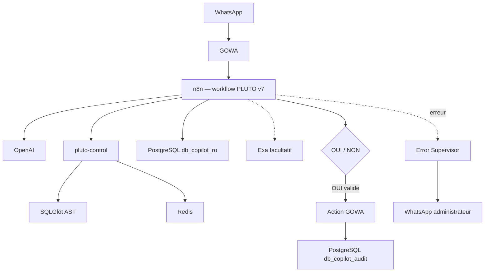

# Architecture PLUTO DB Copilot v7

## Flux conversationnel

1. GOWA transmet un événement au webhook n8n.
2. PLUTO filtre groupes, messages émis par le bot et formats inconnus.
3. Un accusé est envoyé immédiatement.
4. Le contexte temporaire est lu depuis Redis.
5. OpenAI génère un SELECT.
6. La garde déterministe, SQLGlot puis `EXPLAIN` PostgreSQL le valident.
7. Le rôle read-only exécute la lecture.
8. OpenAI synthétise les lignes ; QuickChart produit le graphique si demandé.
9. Un résumé limité est écrit dans Redis avec expiration.

## Flux proactif

Le cron lit ventes et stocks. Sans anomalie ou sous le seuil de confiance, le
workflow se termine dans un nœud silencieux. Sinon PLUTO collecte des preuves,
propose une action et crée une autorisation de trente minutes liée au chat.

Un OUI valide déclenche GOWA. La confirmation n'est construite qu'après succès,
puis un rôle PostgreSQL séparé écrit l'audit. Un échec d'audit ne transforme pas
l'action en échec : PLUTO distingue les deux états et prévient l'administrateur.

## Frontières de sécurité

- `pluto-control` et Redis ne publient aucun port hôte ;
- n8n n'utilise jamais le rôle administrateur pour les données métier ;
- le rôle audit ne peut pas lire les tables ERP ;
- Redis ne reçoit pas les lignes SQL brutes, seulement un contexte résumé ;
- le numéro complet de destination n'apparaît pas dans l'audit visible.
